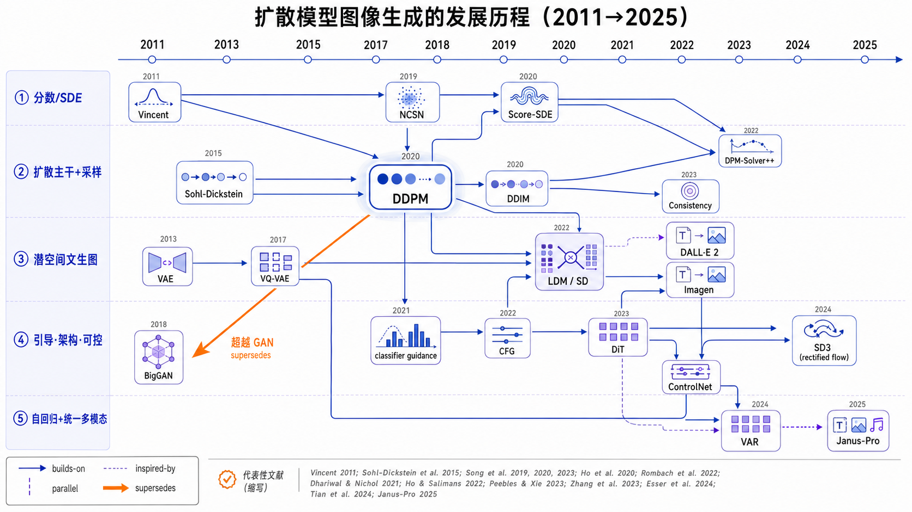
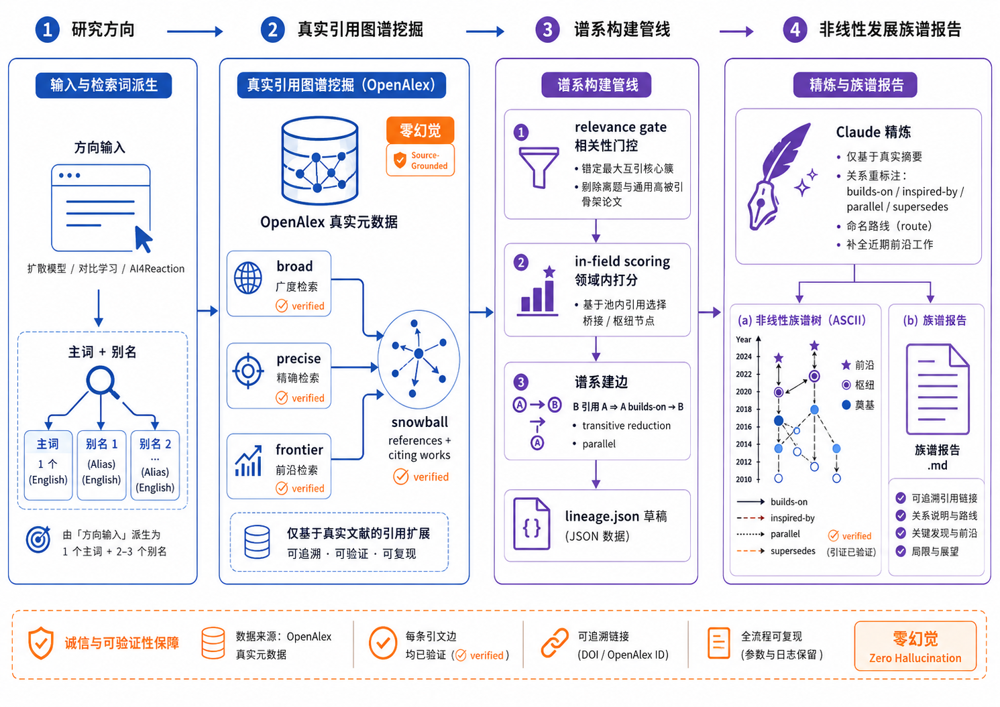

# research-genealogy

> Input a research direction → get its **development genealogy**, not just a paper list.

A [Claude Code](https://claude.com/claude-code) skill that researches the
literature for a field (e.g. *"generated image detection"*, *"对比学习"*,
*"neural machine translation"*) and lays out **how it evolved**: the founding
work → the problem it tackled → who built on it → which lines ran in **parallel**
→ what got superseded → today's frontier.

Output is a terminal **ASCII genealogy tree** (drawn with `--` connectors) plus a
short narrative — the relationships are **non-linear** (branches & parallel
lines), not a flat timeline.

*(featured example — full report: [`examples/diffusion-models-genealogy.md`](examples/diffusion-models-genealogy.md))*

**「扩散模型图像生成」发展历程 · 18 篇关键论文 · 2015 → 2025 · 引用边 13 ✓ / 1 ∥ / 2 ‼ / 6 ⚠**



*（图为早先 21 节点（2011→2025）那一版的渲染；下方 ASCII 摘录与链接报告为最新 18 节点（2015→2025）版本。）*

The same genealogy is what the skill actually emits as a **terminal ASCII tree** (excerpt):

```
      ╭────────────────────────────────────────────────────────────────╮
      │ 扩散模型图像生成 (Diffusion Models)  ·  18 papers · 2015 → 2025 │
      ╰────────────────────────────────────────────────────────────────╯
 2015 │ ● Sohl-Dickstein ─ 扩散奠基（非平衡热力学）
 2019 │ ● Yang Song ─ NCSN（score matching）→ Score-SDE (2020) → EDM (2022)   分数/SDE 总纲
 2020 │   └─ ◉ Ho — DDPM ✓   引爆点：扩散追平 GAN
 2020 │        ├─ ○ J. Song — DDIM ✓  确定性快速采样
 2021 │        └─ ◉ Dhariwal — Beat GANs ✓   架构 + classifier guidance 确立 SOTA
 2022 │             ├─ ★ Ho — CFG ✓  文生图总开关 → Imagen ✓
 2022 │             ├─ ◉ Ramesh — DALL·E 2 ✓   unCLIP 路线
 2022 │             └─ ◉ Rombach — LDM / Stable Diffusion ✓  潜空间扩散（全树最高引用）
 2023 │                  ├─ ★ Peebles — DiT ✓  Transformer 骨干 + scaling
 2024 │                  │   ├─ ★ Esser — SD3 ✓   rectified flow → FLUX.1 Kontext (2025) ⚠
 2024 │                  │   └─ ★ VAR ✓   自回归「下一尺度」∥ SD3 → Janus-Pro (2025) ⚠
 2023 │                  └─ ★ Zhang — ControlNet ✓  即插即用可控生成

      ● founder ◉ hub ★ frontier · ├─ builds-on ├┈ inspired-by ∥ parallel ⇒ supersedes
      citations: ✓ 13 verified · ∥ 1 parallel · ‼ 2 mutual · ⚠ 6 (近年论文参考文献待上游索引)
```

> A left **year axis**, role markers (**●** founder / **◉** hub / **★** frontier),
> **relation-coded branches** (`├──` builds-on, `├┈┈` inspired-by), citation
> bars, `∥ parallel` / `⇒ supersedes` cross-links, and per-edge `✓`/`⚠`
> verification marks. The frontier pass guarantees recent work (here through the
> 2024–2025 autoregressive / unified-multimodal wave) is included, not just the
> classics. *(See also: [`generated-image-detection.md`](examples/generated-image-detection.md), [`ai4reaction-genealogy.md`](examples/ai4reaction-genealogy.md).)*

## Why this is different

| Existing tools | What they give | What's missing |
| --- | --- | --- |
| Survey generators (SurveyForge, AutoSurvey…) | a survey organized **by theme** | not *who built on whom* |
| ResearchRabbit | a citation **graph** to read yourself | no narrative |
| Paper search (Semantic Scholar…) | a **list** | no lineage |

`research-genealogy` gives you the **lineage**: a readable genealogy of ideas
with explicit `builds-on` / `parallel` / `supersedes` edges.

## No hallucinated papers — and verifiable edges

Every node comes from **real metadata** fetched from [OpenAlex](https://openalex.org)
(or Semantic Scholar) — Claude *organizes and narrates*, it never *recalls* papers
from memory. Node summaries are written from the papers' **real abstracts**
(`--abstract`).

And the lineage itself is **checkable**: `scripts/verify.py` confirms that every
`builds-on` edge is a *real citation* in the data, marking each `✓ verified`,
`⚠ unverified`, `↺ reversed`, or `‼ cross-cite`. The genealogy shows the marks
inline — so you can trust the arrows, not just the boxes.

Verification is **duplicate-record aware**: OpenAlex frequently stores a paper
under several work-ids, so an exact-id check alone reports false `⚠`. `verify.py`
reconciles by normalized **title / DOI** and **falls back to Semantic Scholar**
when OpenAlex's reference list is empty — so a real citation stays `✓` and a
surviving `⚠` is far more likely a genuine gap. Drafts also **auto-link orphan
nodes** and **repair polluted abstracts** from Semantic Scholar, and API calls
are disk-cached for fast, reproducible re-runs. (`python3 scripts/selftest.py`
guards these invariants.)

```
 2019 │     └── ◉ Ning Yu et al. ✓   █████░░  426     ← edge verified as a real citation
 2026 │     └── ★ Koutlis et al. ⚠   ·······    0     ← citation not found; flagged honestly
      …
      citations: ✓ 16 verified  ⚠ 0 to review   (run verify.py)
```

Stdlib-only scripts, no pip install, no API key required.

## How it works



Four stages, left to right: **① 输入与检索词派生** (a research direction → 1 primary + 2–3 alias English phrasings) → **② 真实引用图谱挖掘 (OpenAlex)** (multi-pass `broad / precise / frontier` search + citation `snowball` over references & citing works) → **③ 谱系构建管线** (`relevance gate` → `in-field scoring` → edge derivation with transitive reduction & parallel detection → a draft `lineage.json`) → **④ 非线性发展族谱报告** (Claude refines summaries/relations from real abstracts, then renders the ASCII genealogy tree + an era-by-era report). The orange **零幻觉 / Zero-hallucination** thread is the invariant: every node is real OpenAlex metadata and every `builds-on` edge is a `✓ verified` real citation.

**Claude proposes, the scripts verify.** Stage ② is not just blind keyword
search: Claude first researches the field with its own knowledge **and live
`WebSearch`** (the way you'd answer "调研一下 X 方向") and names the landmark and
newest papers — then *every proposed title is resolved to a real record* before
it can become a node (`--seed-titles` / `papers.py resolve`). This combines an
expert's recall with hard grounding: a title that resolves to nothing is listed
in `_unresolved`, never invented. For the **2026 frontier**, WebSearch plus a
dedicated **arXiv pass** catch the newest preprints OpenAlex hasn't indexed yet —
arXiv-only papers are kept honest (real arXiv metadata, no fabricated citations).

## Install

```bash
npx skills add unumbrela/research-genealogy -g -a claude-code
```

Or drop this folder into `~/.claude/skills/research-genealogy/`.

## Use

In Claude Code, just ask:

> 帮我梳理「生成图像检测」这个方向的发展历程
>
> 调研搜索 AI4Reaction 方向的发展历程

Claude turns the direction into English search phrasings (community nicknames
like "AI4Reaction" included), builds a citation-grounded draft, refines it,
and delivers a **full report** — genealogy tree + era-by-era narrative +
verified paper list — saved as markdown.

### Worked example: "扩散模型 / Diffusion Models"（首页配图即此例）

From *扩散模型图像生成*, the skill pulled a 90-paper relevance core and, after
refinement, a **21-node genealogy across 5 lanes spanning 2011 → 2025** (founding
score/diffusion theory → DDPM → sampling-acceleration & guidance lines → the
text-to-image trio → DiT / ControlNet / SD3 → the 2024–2025 **autoregressive
(VAR) / unified-multimodal (Janus-Pro)** wave) — full report →
[`examples/diffusion-models-genealogy.md`](examples/diffusion-models-genealogy.md);
figure & prompt → [`examples/diffusion-models-figure-prompt.md`](examples/diffusion-models-figure-prompt.md).

It is also the cleanest illustration of the **honesty rule**. `verify.py` reports
**25 ✓ / 1 ∥ / 2 ⚠**, and the verification upgrade earns that: duplicate-record
reconciliation flips false ⚠ (BigGAN, Sohl-Dickstein — cited under a different
work-id) to ✓ with no hand-aligning, and the Semantic Scholar fallback confirms
edges OpenAlex left empty (VQ-VAE; **VAR's real citations to VQ-VAE + DiT**). The
2 remaining ⚠ are honest *"data not indexed yet"*, not invention — DPM-Solver++'s
2025 reprint and the very recent **Janus-Pro (2025)** have no reference list
upstream. And there is **no fabricated 2026 node**: OpenAlex/S2 haven't indexed
substantive 2026 image-generation landmarks yet, so the genealogy honestly stops
at 2025.

### Worked example: "调研搜索 AI4Reaction 方向的发展历程"

From that one ask, the skill derived 4 English phrasings (reaction prediction /
retrosynthesis / yield prediction / LLM chemistry), pulled 15 load-bearing
papers spanning **1995 → 2025** with 17/19 edges citation-verified, and wrote
the full report → [`examples/ai4reaction-genealogy.md`](examples/ai4reaction-genealogy.md).
A taste of the narrative:

> **转折一：闭环（2019）——从"纸面规划"到"动手做实验"**
> Coley (2019, Science) 把 AI 合成规划接上机器人流动化学平台，首次闭环
> "规划→执行"。这一步改写了问题本身：此前 AI4Reaction 是预测问题，此后它
> 逐渐变成自主化学问题——这正是四年后 LLM 代理浪潮的舞台。
>
> **转折二：LLM 冲击（2023–2024）** — Boiko (2023, Nature) 的 Coscientist
> 证明 GPT-4 可以自主完成"设计—执行—分析"的完整科研闭环；与之并行，
> Bran (2024) 的 ChemCrow 走"LLM+18 种化学工具"的代理框架路线……

…and the genealogy tree it hangs off (excerpt):

```
 1995 │  ● Hiroko Satoh et al.      SOPHIA：从反应数据库导出知识库（专家系统时代）
 2011 │     └── ○ Kayala et al.     首批 ML 反应预测
 2017 │         ├── ○ Coley et al.    「模板+ML」前向预测范式
 2019 │         │   ├── ◉ Schwaller    Molecular Transformer（纯文本路线）
 2024 │         │   │   ├── ★ Bran      ChemCrow：LLM+18 化学工具代理
 2025 │         │   │   │   └── ★ Song    多代理机器人 AI 化学家
 2019 │         │   └── ◉ Coley        AI 规划+机器人闭环合成 (Science)
 2023 │         │       └── ★ Boiko      Coscientist 自主科研 (Nature)
 2017 │         └── ○ Segler → Liu    神经符号 → seq2seq 逆合成路线
```

The same standard applies to the image-detection example:
[`examples/generated-image-detection.md`](examples/generated-image-detection.md)
(2018 GAN 取证 → 频域/泛化双路线 → 扩散冲击三路并行 → CLIP/可解释前沿,
16/16 edges verified).

### One command (fast path)

```bash
python3 scripts/genealogy.py "generated image detection" --nodes 12 --render

# niche / multi-branch directions: give the field's other names as aliases
python3 scripts/genealogy.py "machine learning chemical reaction prediction" \
    --alias "retrosynthesis prediction deep learning" \
    --alias "reaction yield prediction machine learning" \
    --alias "large language models chemistry reactions" \
    --nodes 14 --render

# best results: let Claude name the key + newest papers first (knowledge +
# WebSearch), write them to seeds.txt, then ground them all
python3 scripts/genealogy.py "diffusion models image generation" \
    --alias "latent diffusion text-to-image" \
    --seed-titles seeds.txt --nodes 14 --render
```

The draft pipeline (all grounded in real metadata):

0. **seed grounding** (`--seed-titles`) — resolves the titles Claude proposed
   (its knowledge + WebSearch) to real OpenAlex/arXiv records and injects them as
   trusted nodes; titles that resolve nowhere go to `_unresolved`, never invented;
1. **multi-pass search** — broad + precise + frontier (recent work that
   citation-sort would bury);
2. **arXiv frontier pass** — pulls the newest preprints (OpenAlex can lag months
   behind, the usual reason a genealogy "stops 2–3 years ago"), back-resolving
   each to OpenAlex by title to recover real references; truly-unindexed ones are
   surfaced as `_frontier_candidates` to wire in by hand — never auto-added, so
   the "edges are real citations" guarantee holds;
3. **citation snowball** — references + citing works of the field's core
   papers, so landmarks the keywords missed still enter the pool;
3. **relevance gate** — anchored on the largest mutually-citing cluster of
   precise matches; off-topic keyword twins and generic mega-cited backbones
   (ResNet & friends) are dropped, and misdated duplicate records (a "2025"
   paper with thousands of citations) get their year fixed from the data;
4. **in-field ranking** — nodes scored by citations *within the pool*, so the
   field's true landmarks beat globally-famous tangents;
5. **lineage edges** — "B cites A" ⇒ `A --builds-on--> B`, then **transitive
   reduction** (drop A→C when A→B→C exists — a readable chain instead of a
   star), nearest-predecessor parents, and **parallel detection** (same-era
   pairs that share references but don't cite each other).

Every `builds-on` edge is a real citation by construction and arrives
pre-marked `✓ verified`. The draft also ships `_frontier_candidates` /
`_alternates` swap pools and per-phrasing diagnostics (`precise hits`, `core`
size) so the refiner knows when to re-phrase. The draft also pre-labels some
`inspired-by` / `supersedes` relations heuristically (flagged `?` for the refiner
to confirm). Claude then refines summaries, prunes/replaces nodes, confirms the
relations, and delivers a full report — genealogy tree + era-by-era narrative —
saved as markdown (see `SKILL.md`; example: `examples/ai4reaction-genealogy.md`).

Before rendering, a **quality gate** keeps half-finished genealogies from
shipping:

```bash
python3 scripts/lint.py lineage.json     # fails on blank summaries, draft
                                         # residue, star topology, a stale or
                                         # thin frontier, orphans, missing branches
```

Flags: `--alias` (repeatable — synonyms / sub-branch phrasings merged into one
pool), `--suggest-aliases` (mine candidate phrasings from a seed search before
you commit), `--from-year/--to-year` scope the genealogy, `--no-expand` skips the
snowball for a quick draft.

### Output formats

```bash
python3 scripts/render_tree.py lineage.json                     # colored terminal tree (default)
python3 scripts/render_tree.py lineage.json --format mermaid    # GitHub-renderable graph
python3 scripts/render_tree.py lineage.json --format markdown   # report: tree + table + edges
python3 scripts/render_tree.py lineage.json --format bibtex     # cite every node
python3 scripts/render_tree.py lineage.json --format drawio     # editable draw.io / diagrams.net diagram
```

### Manual passes (full control)

```bash
# anchor search (relevance); add --precise if results look off-topic
python3 scripts/papers.py search "generated image detection" --limit 25
# landmark lookup by exact title -> real id/metadata (+abstract to ground summary)
python3 scripts/papers.py search "CNN-Generated Images Are Surprisingly Easy to Spot" --abstract --limit 1
# frontier pass (REQUIRED): recent work that citation-sort would bury
python3 scripts/papers.py search "AI-generated image detection" --precise --from-year 2024 --sort citations --limit 15
# expand a hub to ground edges, verify, render
python3 scripts/papers.py expand W3034577585 --limit 25 --abstract
python3 scripts/verify.py lineage.json --write
python3 scripts/render_tree.py lineage.json
```

Search flags: `--precise` (every term in title/abstract — cuts off-topic
giants), `--from-year / --to-year` (time window), `--sort relevance|citations|recent`,
`--abstract` (ground summaries). Backends: `--source openalex` (default, keyless)
or `--source s2` (set `S2_API_KEY`). Set `OPENALEX_MAILTO=you@example.com` for
OpenAlex's faster pool.

## lineage.json schema

```json
{
  "field": "生成图像检测",
  "nodes": [
    {"id":"wang2020","title":"...","authors":"Wang et al.","year":2020,
     "venue":"CVPR","citations":1500,
     "problem":"<一句话问题>","contribution":"<一句话方法>","url":"https://..."}
  ],
  "edges": [
    {"from":"marra2018","to":"wang2020","relation":"builds-on"}
  ]
}
```

`relation` ∈ `builds-on` | `inspired-by` | `parallel` | `supersedes`.
A node may have several parents — that's the point.

## License

MIT
