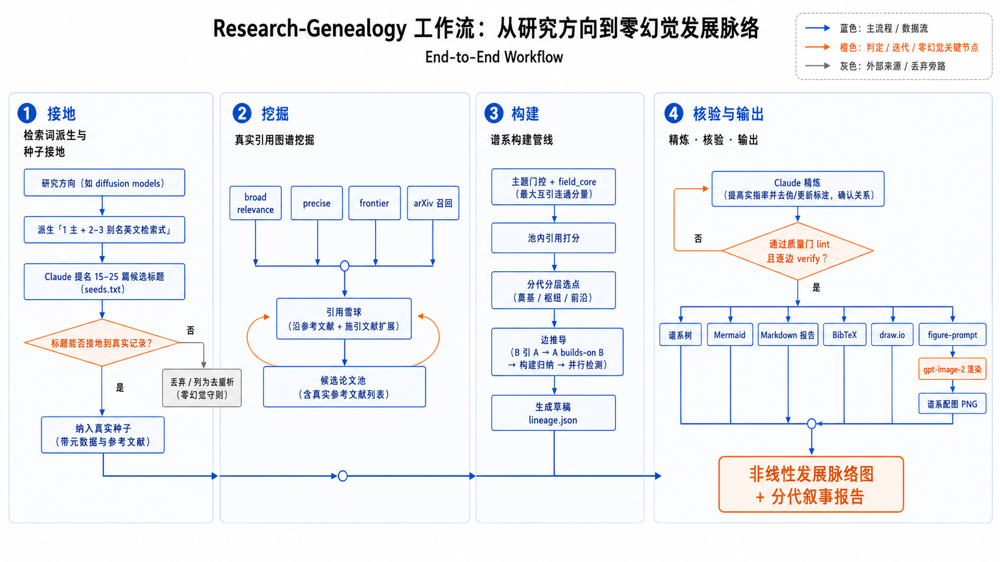

<div align="center">

# research-genealogy · 研究方向发展族谱

**输入一个研究方向 → 得到它的「发展脉络」，而不是一份论文清单。**

中文 ｜ [English](README.en.md)

[](LICENSE)
&nbsp;[](https://claude.com/claude-code)

</div>

---

## 这是什么

`research-genealogy` 是一个 [Claude Code](https://claude.com/claude-code) **技能（skill）**。
你给它一个研究方向（比如「生成图像检测」「对比学习」「扩散模型」），它会去检索真实文献，
然后告诉你这个方向**是怎么一步步发展起来的**：

> 谁开创了它 → 它当时要解决什么问题 → 谁在它的基础上往前走 → 哪几条技术路线在**并行**竞争
> → 什么方法被取代了 → 今天的前沿在哪。

产物是一棵**终端 ASCII 族谱树** + 一段**分年代的叙述报告**。和「论文列表」最大的区别是：
它画的是论文之间的**关系**（分叉、并行、取代），是**非线性**的，而不是一条按时间排下来的流水账。

---

## 先看效果

下面是「扩散模型图像生成」方向的族谱（18 篇关键论文，2015 → 2025，引用边经 OpenAlex/Semantic Scholar 核验）。
完整报告见 [`examples/diffusion-models-genealogy.md`](examples/diffusion-models-genealogy.md)。


这张图就是技能实际输出的**终端 ASCII 树**，长这样（摘录）：

```
      ╭────────────────────────────────────────────────────────────────╮
      │ 扩散模型图像生成 (Diffusion Models)  ·  18 papers · 2015 → 2025 │
      ╰────────────────────────────────────────────────────────────────╯
 2015 │ ● Sohl-Dickstein ─ 扩散奠基（非平衡热力学）
 2019 │ ● Yang Song ─ NCSN（score matching）→ Score-SDE (2020) → EDM (2022)   分数/SDE 总纲
 2020 │   └─ ◉ Ho — DDPM ✓   引爆点：扩散追平 GAN
 2020 │        ├─ ○ J. Song — DDIM ✓  确定性快速采样
 2021 │        └─ ◉ Dhariwal — Beat GANs ✓   架构 + classifier guidance 确立 SOTA
 2022 │             ├─ ★ Ho — CFG ✓  文生图总开关 → Imagen ✓
 2022 │             ├─ ◉ Ramesh — DALL·E 2 ✓   unCLIP 路线
 2022 │             └─ ◉ Rombach — LDM / Stable Diffusion ✓  潜空间扩散（全树最高引用）
 2023 │                  ├─ ★ Peebles — DiT ✓  Transformer 骨干 + scaling
 2024 │                  │   ├─ ★ Esser — SD3 ✓   rectified flow → FLUX.1 Kontext (2025) ⚠
 2024 │                  │   └─ ★ VAR ✓   自回归「下一尺度」∥ SD3 → Janus-Pro (2025) ⚠
 2023 │                  └─ ★ Zhang — ControlNet ✓  即插即用可控生成

      ● 奠基  ◉ 枢纽  ★ 前沿 · ├─ builds-on  ├┈ inspired-by  ∥ parallel  ⇒ supersedes
      citations: ✓ 13 verified · ∥ 1 parallel · ‼ 2 mutual · ⚠ 6（近年论文参考文献待上游索引）
```

**怎么读这棵树：** 左边是**年份轴**；节点前的符号是它的角色（**●** 奠基 / **◉** 枢纽 / **★** 前沿）；
分支线区分关系（`├──` 建立在其上、`├┈┈` 受其启发）；右侧的引用条是热度；`∥` 表示同期并行、`⇒` 表示取代；
每条边末尾的 `✓` / `⚠` 是**引用是否被核验**的标记。

> 还有两个现成例子：[生成图像检测](examples/generated-image-detection.md)、
> [AI4Reaction（AI 化学反应预测）](examples/ai4reaction-genealogy.md)。

---

## 它解决什么问题

你想快速搞懂一个陌生方向时，现有工具能给你的，往往不是你真正想要的那一层：

| 现有工具 | 它给你什么 | 缺了什么 |
| --- | --- | --- |
| 综述生成器（SurveyForge、AutoSurvey…） | 一篇**按主题**组织的综述 | 没讲清「谁建立在谁之上」 |
| ResearchRabbit | 一张**引用图**，要你自己读 | 没有叙述脉络 |
| 论文搜索（Semantic Scholar…） | 一个**列表** | 没有传承关系 |

`research-genealogy` 补上的正是中间那一层——**lineage（传承脉络）**：一份能读的「思想族谱」，
节点之间带着明确的 `builds-on`（建立在其上）/ `parallel`（并行）/ `supersedes`（取代）关系。

---

## 两个核心承诺

这类工具最大的风险是「一本正经地编造论文」。本项目用两条硬规则把它堵死：

**① 零幻觉——论文都是真的。**
每个节点都来自 [OpenAlex](https://openalex.org)（或 Semantic Scholar）抓回的**真实元数据**。
Claude 负责的是「组织和叙述」，绝不凭记忆把论文「回忆」出来；节点的一句话总结也是从论文**真实摘要**里写的。
一个查不到的标题会被隔离在 `_unresolved` 里，**永远不会被编成一个节点**。

**② 引用可验证——连接都是真的。**
族谱里每一条 `builds-on` 边，都对应数据中的一次**真实引用**。`scripts/verify.py` 会逐条核对，
标上 `✓ 已核验` 或 `⚠ 未找到`，并把结果直接画在树上——所以你可以信任这些箭头，而不只是相信那些方框。

```
 2019 │     └── ◉ Ning Yu et al. ✓   █████░░  426     ← 这条边核验为真实引用
 2026 │     └── ★ Koutlis et al. ⚠   ·······    0     ← 没找到引用，如实标记
      …
      citations: ✓ 16 verified  ⚠ 0 to review   (run verify.py)
```

> 所有脚本只用 Python 标准库——**无需 `pip install`，无需 API Key**。

---

## 工作原理



从左到右四个阶段，一条「零幻觉」主线贯穿始终：

| 阶段 | 在做什么 |
| --- | --- |
| **① 输入与检索词派生** | 把你说的方向（可能是中文/外号）翻成文献里真正用的 1 个主检索词 + 2–3 个别名说法。 |
| **② 真实引用图谱挖掘（OpenAlex）** | 多轮检索（broad / precise / frontier）+ 顺着引用做「滚雪球」，把方向的核心论文都捞进来。 |
| **③ 谱系构建管线** | 相关性筛选 → 领域内打分 → 从真实引用图推导边（含传递约简、并行检测），产出草稿 `lineage.json`。 |
| **④ 非线性发展族谱报告** | Claude 用真实摘要打磨每个节点的总结与关系，再渲染成 ASCII 族谱树 + 分年代叙述报告。 |

**关键在于：Claude 提出，脚本核验。** 第②步不是盲目的关键词搜索——Claude 会先用自己的知识
**外加实时 `WebSearch`**（就像你被问「调研一下 X 方向」时会做的）点出地标论文和最新论文，
**但每个被提名的标题都必须先落地成一条真实记录**才能成为节点。这样既有专家级的「回忆」，又有硬核的「接地」。

---

## 安装

```bash
npx skills add unumbrela/research-genealogy -g -a claude-code
```

或者直接把本目录拷到 `~/.claude/skills/research-genealogy/`。

---

## 怎么用

装好后，在 Claude Code 里**直接用大白话提需求**就行：

> 帮我梳理「生成图像检测」这个方向的发展历程
>
> 调研搜索 AI4Reaction 方向的发展历程

Claude 会自动把方向翻成英文检索词（连「AI4Reaction」这种社区外号也能认）、抓取真实文献、
构建并打磨族谱，最后交给你一份**完整报告**——族谱树 + 分年代叙述 + 已核验的论文清单，存成一个 markdown 文件。

### 三个现成案例

| 方向 | 一句话 | 报告 |
| --- | --- | --- |
| 扩散模型图像生成 | 18 节点、5 条路线、2015→2025，从 DDPM 到 SD3 / 自回归 / 统一多模态 | [diffusion-models-genealogy.md](examples/diffusion-models-genealogy.md) |
| 生成图像检测 | GAN 取证 → 频域/泛化双路线 → 扩散冲击三路并行 → CLIP 前沿，16/16 边核验 | [generated-image-detection.md](examples/generated-image-detection.md) |
| AI4Reaction（AI 化学反应预测） | 1995→2025，从专家系统到 LLM 化学代理，17/19 边核验 | [ai4reaction-genealogy.md](examples/ai4reaction-genealogy.md) |

---

## 进阶用法

<details>
<summary><b>命令行一键生成草稿（不进 Claude 对话也能跑）</b></summary>

```bash
# 最简：一个方向直接出草稿并渲染
python3 scripts/genealogy.py "generated image detection" --nodes 12 --render

# 小众/多分支方向：把这个领域的其它叫法作为别名一起喂
python3 scripts/genealogy.py "machine learning chemical reaction prediction" \
    --alias "retrosynthesis prediction deep learning" \
    --alias "reaction yield prediction machine learning" \
    --alias "large language models chemistry reactions" \
    --nodes 14 --render

# 效果最佳：先让 Claude（知识 + WebSearch）点名关键论文和最新论文，
# 写进 seeds.txt，再统一接地为真实记录
python3 scripts/genealogy.py "diffusion models image generation" \
    --alias "latent diffusion text-to-image" \
    --seed-titles seeds.txt --nodes 14 --render
```

草稿管线全程基于真实元数据：种子接地（`--seed-titles`，查不到的进 `_unresolved`，绝不编造）→
多轮检索（broad + precise + frontier）→ arXiv 前沿补漏 → 引用滚雪球 → 相关性筛选 → 领域内打分 →
从真实引用图推导边（传递约简 + 最近祖先 + 并行检测）。每条 `builds-on` 边天然是真实引用，预标 `✓ verified`。

渲染前用质量门拦住「半成品」族谱：

```bash
python3 scripts/lint.py lineage.json     # 空总结、草稿残留、星形拓扑、前沿过旧/过薄、孤儿节点等都会报错
```

常用参数：`--alias`（可重复，多种叫法合并进一个池）、`--suggest-aliases`（先挖候选检索词）、
`--from-year/--to-year`（限定年代范围）、`--no-expand`（跳过滚雪球，快速出草稿）。
</details>

<details>
<summary><b>输出格式（终端树 / Markdown 报告 / 配图提示词）</b></summary>

```bash
python3 scripts/render_tree.py lineage.json                       # 彩色终端树（默认）
python3 scripts/render_tree.py lineage.json --format markdown     # 报告：树 + 论文表 + 边
python3 scripts/render_tree.py lineage.json --format figure-prompt # 给图像模型用的提示词（含硬性结构清单）
```

`--format figure-prompt` 会写出一段可直接喂给图像模型（GPT-image / Midjourney / DALL·E）的提示词：
一段风格化正文 **+ 一份硬性结构清单**（逐条列出每个节点和每条边，带 ✓/⚠ 标记）——这样模型只能画出
真实的、有引用支撑的连接，画不出编造的连接。`--lang en` 出英文版。
示例：[`examples/diffusion-models-figure-prompt.md`](examples/diffusion-models-figure-prompt.md)。
</details>

<details>
<summary><b>一键出图（把提示词渲染成 PNG）</b></summary>

把上面的提示词接到一个 OpenAI 兼容的图像中转站（跑 `gpt-image-2`），即可直接出图：

```bash
python3 scripts/gen_figure.py lineage.json --out figure.png         # 谱系数据 → 提示词 → 图（默认 ZenMux）
python3 scripts/gen_figure.py lineage.json --api-key sk-… --out figure.png  # 填自己的 Key
python3 scripts/gen_figure.py lineage.json --relay wegoo --out figure.png   # 改用备用中转站
```

**没有任何 Key 也能用。** 找不到 Key 时脚本不会报错，而是把提示词存成
`<输出名>.prompt.txt` 并提示你两条路：①设置 `ZENMUX_API_KEY` / 加 `--api-key` 后重跑自动出图；
②直接把这份提示词粘到 ChatGPT / GPT 生图页面（或 Midjourney / DALL·E）手动出图。
中转站配置与 API Key 处理见 [`image-relay.md`](image-relay.md)。
</details>

<details>
<summary><b>手动检索（完全掌控每一步）</b></summary>

```bash
# 锚点检索（相关性）；结果跑题就加 --precise
python3 scripts/papers.py search "generated image detection" --limit 25
# 按精确标题查地标论文 → 真实 id/元数据（+abstract 用于写总结）
python3 scripts/papers.py search "CNN-Generated Images Are Surprisingly Easy to Spot" --abstract --limit 1
# 前沿补漏（重要）：按引用排序会埋掉的近期工作
python3 scripts/papers.py search "AI-generated image detection" --precise --from-year 2024 --sort citations --limit 15
# 展开某个枢纽节点以接地边，核验，渲染
python3 scripts/papers.py expand W3034577585 --limit 25 --abstract
python3 scripts/verify.py lineage.json --write
python3 scripts/render_tree.py lineage.json
```

检索参数：`--precise`（每个词都要命中标题/摘要，剔除跑题巨头）、`--from-year/--to-year`（时间窗）、
`--sort relevance|citations|recent`、`--abstract`（用于写总结）。后端：`--source openalex`（默认，无需 Key）
或 `--source s2`（设 `S2_API_KEY`）。设 `OPENALEX_MAILTO=you@example.com` 可走 OpenAlex 更快的池子。
</details>

<details>
<summary><b><code>lineage.json</code> 数据结构</b></summary>

```json
{
  "field": "生成图像检测",
  "nodes": [
    {"id":"wang2020","title":"...","authors":"Wang et al.","year":2020,
     "venue":"CVPR","citations":1500,
     "problem":"<一句话问题>","contribution":"<一句话方法>","url":"https://..."}
  ],
  "edges": [
    {"from":"marra2018","to":"wang2020","relation":"builds-on"}
  ]
}
```

`relation` ∈ `builds-on` | `inspired-by` | `parallel` | `supersedes`。
一个节点可以有多个父节点——这正是「非线性族谱」的意义所在。
</details>

> 完整的操作规范（Claude 实际遵循的逐步流程）见 [`SKILL.md`](SKILL.md)。

---

## License

[MIT](LICENSE)
