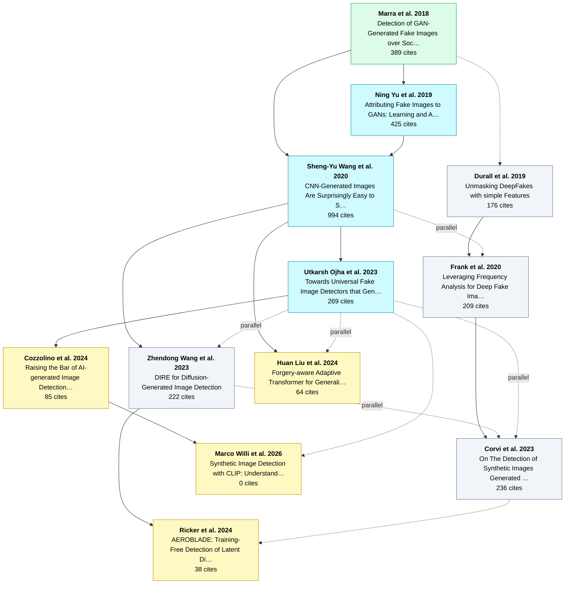

# 样例：生成图像检测 (Generated / AI-Synthesized Image Detection)

> 由 `research-genealogy` skill 真实生成。所有节点取自 OpenAlex（真实论文 ID / 年份 / 引用数），
> 关系边经 `verify.py` 对 OpenAlex 引用核实（✓ 已验证 / ⚠ 待核）。引用数为 2026-06 快照。终端中为彩色输出。

## 发展谱系（终端渲染）

```
      ╭───────────────────────────────────────────────────────────╮
      │ 生成图像检测 (Generated / AI-Synthesized Image Detection) │
      │ 12 papers  ·  2018 → 2026                                 │
      ╰───────────────────────────────────────────────────────────╯
      │
 2018 │  ● Marra et al.   ██████░  389
      │     “Detection of GAN-Generated Fake Images over Social Networks”
      │       发现GAN生成图像残留可检测的模型指纹，奠基判别式检测
      │     │
 2019 │     ├── ◉ Ning Yu et al. ✓   ██████░  425
      │     │   “Attributing Fake Images to GANs: Learning and Analyzing GAN Fingerprints”
      │     │     形式化“GAN指纹”，实现对生成模型的来源归因
      │     │
 2019 │     ├┈┈ ○ Durall et al. ✓   █████░░  176
      │     │   “Unmasking DeepFakes with simple Features”
      │     │     改从频谱(DFT)看上采样伪影，开启频域检测路线
      │     │   │
 2020 │     │   └── ○ Frank et al. ⚠   █████░░  209
      │     │       “Leveraging Frequency Analysis for Deep Fake Image Recognition”
      │     │         用DCT频谱特征做检测，理论化频域路线
      │     │         ∥ parallel: Sheng-Yu Wang et al.
      │     │       │
 2023 │     │       └── ○ Corvi et al. ⚠   ██████░  236
      │     │           “On The Detection of Synthetic Images Generated by Diffusion Models”
      │     │             系统分析扩散图像的伪影，把GAN时代的取证经验迁移到扩散
      │     │             ∥ parallel: Zhendong Wang et al.
      │     │             ∥ parallel: Utkarsh Ojha et al.
      │     │
 2020 │     └── ◉ Sheng-Yu Wang et al. ✓   ███████  994
      │         “CNN-Generated Images Are Surprisingly Easy to Spot… for Now”
      │           单一ResNet+强数据增广，仅用ProGAN训练即可跨多种GAN泛化，成为最强基线
      │           → builds-on: Ning Yu et al.
      │         │
 2023 │         ├── ◉ Utkarsh Ojha et al. ⚠   ██████░  269
      │         │   “Towards Universal Fake Image Detectors that Generalize Across Generative…”
      │         │     改用冻结的CLIP/ViT特征空间+轻量分类，跨GAN与扩散通用检测
      │         │   │
 2024 │         │   ├── ★ Cozzolino et al. ✦NEW ✓   █████░░   85
      │         │   │   “Raising the Bar of AI-generated Image Detection with CLIP”
      │         │   │     系统化CLIP-based通用检测，刷新跨生成器泛化SOTA
      │         │   │
 2026 │         │   └┈┈ ★ Marco Willi et al. ✦NEW ⚠   ·······    0
      │         │       “Synthetic Image Detection with CLIP: Understanding and Assessing”
      │         │         系统剖析CLIP检测器的机制与失效模式，为通用检测建立可解释基础
      │         │         → builds-on: Cozzolino et al.
      │         │
 2023 │         ├── ○ Zhendong Wang et al. ✓   █████░░  222
      │         │   “DIRE for Diffusion-Generated Image Detection”
      │         │     用扩散重建误差(DIRE)作为通用判据检测扩散生成图
      │         │     ∥ parallel: Utkarsh Ojha et al.
      │         │   │
 2024 │         │   └── ★ Ricker et al. ✦NEW ✓   ████░░░   38
      │         │       “AEROBLADE: Training-Free Detection of Latent Diffusion Images Using …”
      │         │         用自编码器重建误差实现免训练检测，延续DIRE思路
      │         │         ⇢ inspired-by: Corvi et al.
      │         │
 2024 │         └── ★ Huan Liu et al. ✦NEW ✓   ████░░░   64
      │             “Forgery-aware Adaptive Transformer for Generalizable Synthetic Image Det…”
      │               前向感知自适应Transformer(FatFormer)，强化跨生成器泛化
      │               ∥ parallel: Utkarsh Ojha et al.

      ● founder  ◉ hub  ★ frontier  ·  ├── builds-on  ├┈┈ inspired-by  ∥ parallel
      citations: ✓ 8 verified  ⚠ 7 to review   (run verify.py)
```

## 引用边验证（`verify.py`）

`verify.py` 对每条 `builds-on` 边核实 OpenAlex 中的真实引用，结果驱动了对谱系的修正：

- **8 条 ✓ 已验证**：被引论文确实引用了前作（如 Wang 2020 → DIRE、Ojha → Cozzolino）。
- **1 条 ‼ cross-cite 被修正**：原标为 `parallel` 的 Corvi 2023 — Ricker 2024，验证发现 Ricker **确实
  引用了** Corvi，遂改为 `inspired-by`（图中显示 `⇢ inspired-by: Corvi et al.`）。这正是该功能的价值。
- **7 条 ⚠ 待核**：OpenAlex 的引用列表缺口（尤其 2026 的 Willi 刚发布、尚未被索引）。**如实标出"无法
  确认"，而非假装确定**——可信度优先。

## Mermaid 视图（GitHub 可直接渲染）

> `render_tree.py ... --format mermaid` 生成；颜色按角色区分（绿=奠基 / 青=枢纽 / 黄=前沿）。



## 叙事走读

**奠基（2018）。** 判别式检测的起点是 **Marra et al. (2018)**，针对“社交网络上 GAN 生成图像难以识别/
溯源”的问题，发现**生成模型会在图像中残留可检测的指纹**——后续几乎所有工作都建立在“生成图像含可学习
痕迹”这一前提上。

**两条主线分叉（2019–2020）。**

- **空间/指纹线。** **Yu et al. (2019)** 把“GAN 指纹”形式化，从“判真假”推进到“**归因到哪个 GAN**”。在
  此之上，**Sheng-Yu Wang et al. (2020, CNNDetection, 994 引最高)** 解决了真正的痛点——**跨架构泛化**：
  仅用 ProGAN 训练 + 强数据增广的单个 ResNet 即可泛化到多种 GAN，成为长期最强基线（树干）。
- **频域线（并行）。** **Durall et al. (2019)** 指出像素域泛化差，改看**频谱**上采样伪影；**Frank et al.
  (2020)** 用 DCT 频谱特征把这条路线理论化。

**扩散时代汇流（2023）。** 生成主力转向扩散模型后“GAN 式指纹”失效，三股力量并行应对：**Ojha et al.
(2023)** 改用**冻结 CLIP/ViT 特征**做通用检测；**Wang et al. (2023, DIRE)** 提出**扩散重建误差**判据；
**Corvi et al. (2023)** 把频域/forensics 经验迁移到扩散。三者互为 `∥ parallel`。

**当下前沿（2024–2026，★）。** 三条子线各自结出最新成果，确认了领域“跨生成范式通用检测”的走向：

- **Cozzolino et al. (2024, “Raising the Bar…with CLIP”)** 在 Ojha 之上系统化 CLIP 路线、刷新 SOTA，
  并由 **Marco Willi et al. (2026)** 进一步**剖析 CLIP 检测器的机制与失效模式**，把这条线推向可解释化；
- **Ricker et al. (2024, AEROBLADE)** 沿 DIRE 的重建误差思路做到**免训练**检测潜在扩散图像；
- **Huan Liu et al. (2024, FatFormer)** 用**自适应 Transformer** 强化对未见生成器的泛化。

（谱系一直延伸到 2026，`frontier` 节点经 `--precise --from-year 2025` 的前沿搜索捞出，避免“停在两三年前”。）

## 当前前沿与开放问题

- **通用性 vs 鲁棒性**：通用检测器在压缩、重采样、对抗扰动下仍易失效；
- **持续泛化 / 免训练**：新生成器层出不穷，免训练（AEROBLADE）与冻结特征（Cozzolino）是当前主攻方向；
- **归因而非仅检测**：Yu(2019) 提出的“溯源到具体模型/版本”至今未解决。

> 复现：
> ```
> python3 scripts/papers.py search "AI-generated image detection" --precise --from-year 2024 --sort citations --limit 12
> python3 scripts/papers.py expand W3034577585 --limit 25     # CNNDetection hub
> python3 scripts/render_tree.py examples/generated-image-detection.json
> ```
